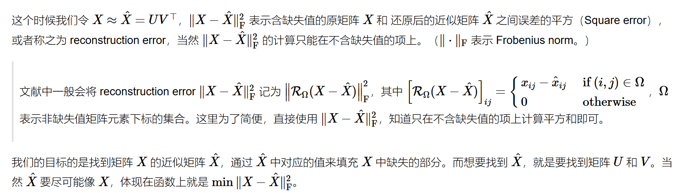
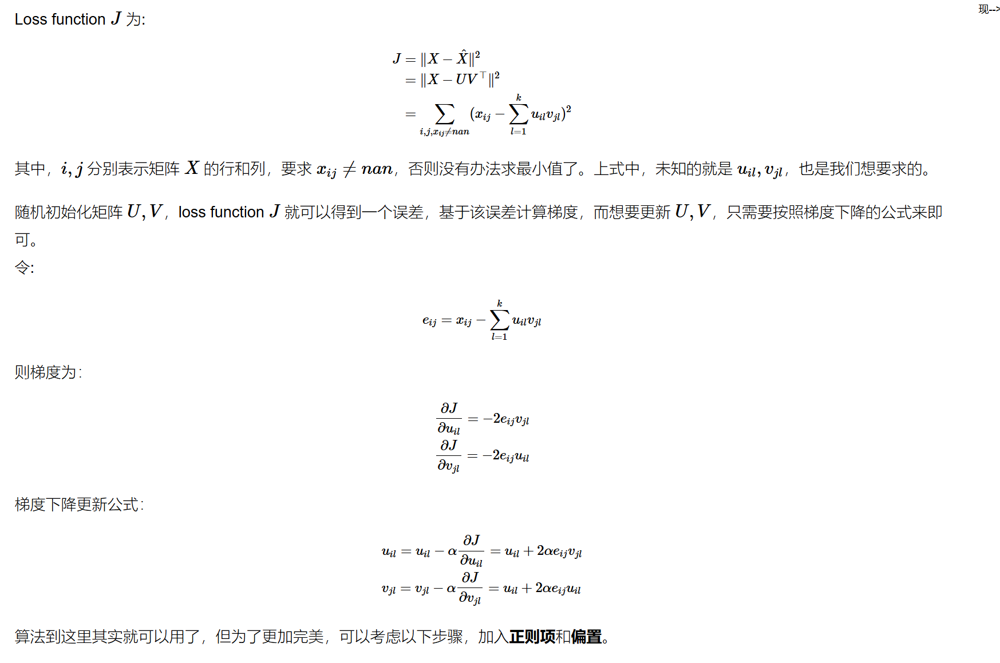
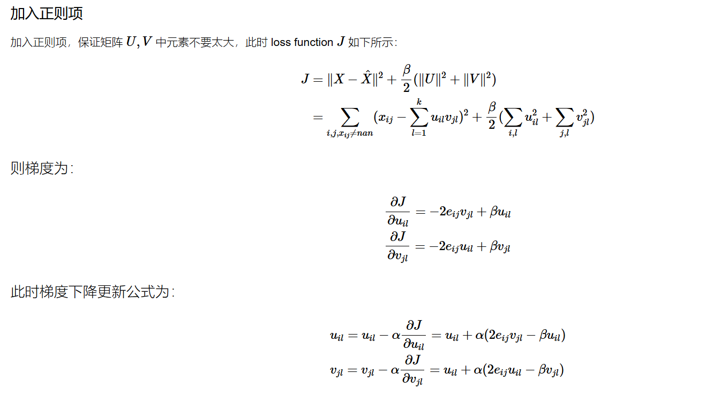
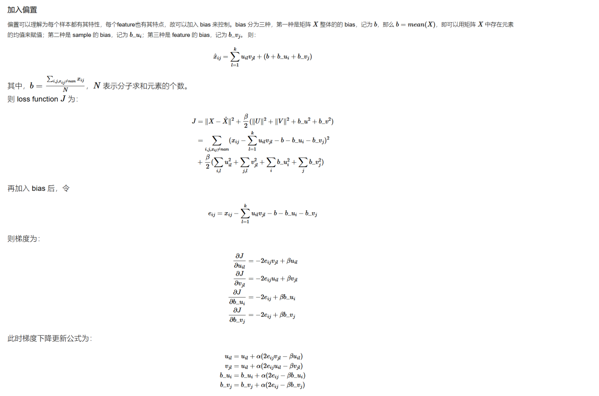

# 使用矩阵分解算法构建电影推荐系统（MovieLens数据集）

## 矩阵分解算法简介
矩阵分解目标：优化两个较低维度矩阵U（用户特征矩阵）和V（电影特征矩阵）进行矩阵乘法能够近似等于真实的“用户-电影评分矩阵”，并且可以对真实但稀疏的“用户-电影评分矩阵”进行缺失值填充，最终以预测评分的高低为标准，实现对用户电影的推荐

### 概念与公式
- X ≈ U * V.T：矩阵分解适用于基于“用户-物品评分矩阵”的协同过滤，“用户-物品评分矩阵”为X，矩阵行对应用户u，列对应电影V，矩阵每个元素XUV表示用户u对电影V的评分，矩阵分解目标是将矩阵x分解为两个较低维度矩阵，U代表用户的潜在特征矩阵（n，k），V代表电影的潜在特征矩阵（m，k），X≈U*V.T表示“用户特征矩阵” * “电影特征矩阵”≈“用户-物品评分矩阵”

- 梯度下降算法：但是X“用户-电影评分矩阵”一般都是稀疏矩阵，每个用户不可能给所有电影评分，所以X中含有大量的缺失值，所以不能用线代知识直接进行矩阵分解，这里用梯度下降法求解，具体思路是找到“用户-电影评分矩阵”的近似矩阵X1，而这个X1又是矩阵U和V构成的，近似矩阵要尽可能像X1，体现在函数上就是求不含缺失值的项上计算近似评分与实际评分的误差平方和E，基于误差E来求导计算梯度。按梯度下降公式来更新用户U和电影V矩阵



- 正则项：使用 L2 正则化，通过惩罚模型的权重（特征向量）的平方值，来限制特征向量的大小，从而减少过拟合的风险，B正则化系数越大会让模型更倾向于避免过拟合


- 偏置项：	偏差项的引入使得模型能够更加精确地调整对每个用户和物品的评分预测，从而提高预测的准确性。
  * b 是全局偏差，表示所有用户和物品的平均评分偏差，在模型里b 计算的是评分矩阵 X 中所有非缺失评分的平均值，即对所有已知评分进行求平均，这样可以让模型在训练开始有一个明确的方向，避免过度震荡
  * b_u是用户特征的偏差
  * b_v是电影特征的偏差



### 矩阵分解模型的代码实现
```
class MF():
    def __init__(self,X,k,alpha,beta,iterations):
        """
        self.X 输入的用户——评分矩阵，缺失值为nan
        self.k 用户特征矩阵U和物品特征矩阵V的隐性因子个数
        self.alpha 学习率，控制每次梯度更新步长
        self.beta 正则化参数，防止过拟合，控制矩阵U V大小
        self.iterations 随机梯度下降迭代次数
        self.not_nan_index 记录有效元素（非空）索引
        """
        self.X = X
        self.num_samples,self.num_features = X.shape#分别代表用户和电影数量
        self.k = k
        self.alpha = alpha
        self.beta = beta
        self.iterations = iterations
        self.not_nan_index = np.isnan(self.X) == False

    def train(self):

        #初始化分解矩阵U、V
        self.U = np.random.normal(scale=1./self.k,size=(self.num_samples,self.k))
        self.V = np.random.normal(scale=1./self.k,size=(self.num_features,self.k))

        #初始化偏置项
        self.b = np.mean(self.X[self.not_nan_index])
        #全局变量b设置为“用户-评分矩阵”非空值的均值，目的是给模型一开始一个基准评分，让模型捕捉整体趋势
        self.b_u = np.zeros(self.num_samples)
        self.b_v = np.zeros(self.num_features)

        #创建训练样本
        self.samples = [(i,j,self.X[i,j])
                        for i in range(self.num_samples)
                        for j in range(self.num_features)
                        if not np.isnan(self.X[i,j])]

        #执行随机梯度下降
        training_process = []
        for i in range(self.iterations):
            np.random.shuffle(self.samples)
            self.sgd()#执行梯度更新
            se = self.square_error()#预测评分与实际评分的平方误差
            training_process.append((i,se))
            if (i+1) % 10 == 0:#10次更新一次损失数据
                print('当前迭代次数：{}，预测评分与实际评分的平方误差值={:.4f}'.format(i+1,se))

    def sgd(self):
        """
        执行随机梯度下降，并进行更新
        """
        for i,j,x in self.samples:
            prediction = self.get_x(i,j)#计算（i,j）位置的预测评分
            e = (x - prediction)#当前预测评分与真实评分的误差
            #print(f"样本误差 ({i},{j}): {e}")

            #更新偏置项:通过误差e来更新
            self.b_u[i] += self.alpha * (2 * e - self.beta * self.b_u[i])
            self.b_v[j] += self.alpha * (2 * e - self.beta * self.b_v[j])

            #更新分解矩阵（隐含因子矩阵）U、V,每次都会根据误差e和用户、物品的特征更新相应的行
            self.U[i,:] += self.alpha * (2*e*self.V[j,:] - self.beta*self.U[i,:])
            self.V[j,:] += self.alpha * (2*e*self.U[i,:] - self.beta*self.V[j,:])

            # 处理 NaN 或无穷大的数值
            self.U[i, :] = np.nan_to_num(self.U[i, :])
            self.V[j, :] = np.nan_to_num(self.V[j, :])

            # 检查更新后 U 和 V 的值
            #print(f"U[{i}, :]: {self.U[i, :]}")
            #print(f"V[{j}, :]: {self.V[j, :]}")

        #手动垃圾回收以释放内存
        gc.collect()# 清理不再需要的内存

    def get_x(self,i,j):
        """
        计算（i,j）位置的预测评分
        """
        prediction = self.U[i,:].dot(self.V[j,:].T) + self.b +self.b_u[i] + self.b_v[j]
        return prediction

    def square_error(self):
        """该方法计算矩阵分解模型的平方误差。平方误差表示模型的预测评分与实际评分之间的差异"""
        predicted = self.full_matrix()#获取完整的评分矩阵
        error = 0
        for i in range(self.num_samples):
            for j in range(self.num_features):
                if self.not_nan_index[i,j]:
                    #只对非空的有效评分进行误差平方和计算，当self.not_nan_index[i,j]为TRUE才会下一步
                    error += pow(self.X[i,j] - predicted[i,j],2)
        return error

    def full_matrix(self):
        """
        使用当前的U、V和偏置项计算完整的评分预测矩阵
        b_u是一维数组，转换为（n,1)，在加法过程中会广播成为(n,m)给每一个评分都加上用户偏置项
        b_v是一维数组，转换为（1,m)，在加法过程中会广播成为(n,m)给每一个评分都加上物品偏置项
         """
        return self.U.dot(self.V.T) + self.b + self.b_u[:,np.newaxis] + self.b_v[np.newaxis,:]

    def replace_nan(self,x_hat):
        """将预测矩阵 X_hat 中对应的评分替换掉原始矩阵 X 中的 NaN 值，返回替换后的矩阵x_new"""
        x_new = np.copy(self.X)
        for i in range(self.num_samples):
            for j in range(self.num_features):
                if np.isnan(x_new[i,j]):
                    x_new[i,j] = x_hat[i,j]
        return x_new

if __name__ == '__main__':
    X = np.array([
        [5, 3, 0, 1],
        [4, 0, 0, 1],
        [1, 1, 0, 5],
        [1, 0, 0, 4],
        [0, 1, 5, 4],
    ], dtype=np.float32)
    X[X == 0] = np.nan
    print('替换nan后的矩阵：',X)

    #测试函数
    mf = MF(X,k=2,alpha=0.1,beta=0.1,iterations=100)
    mf.train()
    x_hat = mf.full_matrix()
    x_comp = mf.replace_nan(x_hat)#获得将预测值替换nan后矩阵

    print('评分预测矩阵',x_hat)
    print('在原用户-评分矩阵上替换nan值的完整矩阵',x_comp)

```

## 电影推荐功能实现

### 数据集加载，转换为用户-电影评分矩阵
```
ra_data_path = 'ml-latest-small/ml-latest-small/ratings.csv'
mf_cache_dir = 'mf_cache'#缓存文件夹
mf_cache_path = os.path.join(mf_cache_dir,'mf_RatingMatrix_cache')
def load_data(data_path,cache_path):
    print('开始分批加载数据集...')
    if not os.path.exists(mf_cache_dir):
        os.makedirs(mf_cache_dir)

    #读取用户-电影评分矩阵
    if os.path.exists(mf_cache_path):
        print('加载缓冲中...')
        rating_matrix = pd.read_pickle(mf_cache_path)
        print('从缓存加载数据集完毕')

    else:
        # 没有缓存就分批处理数据并保存为pickle格式
        dtypes = {'userId':np.int32,'movieId':np.int32,'rating':np.float32}
        print('加载新数据中')

        # 加载前三列数据：用户ID、电影ID、评分
        ratings = pd.read_csv(data_path,dtype=dtypes,usecols=range(3))

        # 转换为用户-电影评分矩阵
        rating_matrix = pd.pivot_table(data=ratings,index=['userId'],columns=['movieId'],values='rating')

        #缓存数据
        rating_matrix.to_pickle(cache_path)
        print('数据加载完毕')
    return rating_matrix
rating_matrix = load_data(ra_data_path,mf_cache_path)
rating_matrix_np = rating_matrix.to_numpy()
print('矩阵类型是否是np',type(rating_matrix_np))
print(rating_matrix_np.shape)
print(rating_matrix_np[:10,:])

#二、电影名称数据集加载
movies_data_path = 'ml-latest-small/ml-latest-small/movies.csv'
dtypes_movies = {'movieId':np.int32,'title':np.str_,'genres':np.str_}
movies = pd.read_csv(movies_data_path,dtype=dtypes_movies)
movies_np = movies.to_numpy()#转换成numpy数组运算内存占用小
print('电影名称文件大小和预览')
print(movies_np.shape)
print(movies_np[:10,:])
```

### 调用MF矩阵分解函数，进行模型训练
定义平方根误差计算函数，并对K值进行迭代，挑选最优隐性特征K值

```
def compute_rmse(rating_matrix,mf):
    #获取预测的矩阵
    predicted_matrix = mf.full_matrix()
    #计算平方误差和
    square_error_sum = mf.square_error()
    #计算非nan的评分数量,~是反运算符号，也就是取非空值为TRUE的数量
    non_nan_count = np.sum(~np.isnan(rating_matrix))
    #计算平方误差和
    rmse = np.sqrt(square_error_sum/non_nan_count)
    return rmse

#2、迭代挑选最优的K值
#k_values = [60,70,80,90,100,110]
#best_k = None
#best_rmse = float('inf')#取正无穷大

#for k in k_values:
#    mf = MF(rating_matrix_np,k=k,alpha=0.01,beta=0.1,iterations=100)
#    training_process = mf.train()
#    rmse = compute_rmse(rating_matrix_np,mf)
 #   print('k值={},RMSE={}'.format(k,rmse))

#    if rmse <best_rmse:#如果迭代的K误差更低，就判定最最优
#        best_rmse = rmse
#        best_k = k
#print('最优的K值为：{}，RMSE={}'.format(best_k,best_rmse))
"""
最优的K值为：110，RMSE=0.2890092949391867
"""
```

### 实现为用户推荐电影
```
if x_comp is not None:
    #获取用户id
    user_id = input('您要向哪位用户推荐电影？请输入用户编号： ')
    user_id = int(user_id) - 1

    #获取该用户评分列表，将该用户评分降序排序
    sortResult = x_comp[int(user_id),:].argsort()[::-1]

    #推荐评分最高10部电影
    idx = 0
    print('为该用户推荐的评分最高的10部电影是：'.center(80,'='))

    #开始推荐
    for i in sortResult:
        print('评分：{:.2f},电影名称：{}'.format(x_comp[int(user_id),i],movies_np[i][1]))
        idx += 1
        if idx == 10:
            break
else:
    print('由于缓冲损坏，程序无法继续，请检查缓存文件')
```

### 输出结果
```
加载缓冲中...
从缓存加载数据集完毕
您要向哪位用户推荐电影？请输入用户编号： 2
==============================为该用户推荐的评分最高的10部电影是：===============================
评分：5.00,电影名称：I'm Still Here (2010)
评分：5.00,电影名称：The Final Girls (2015)
评分：5.00,电影名称：Ender's Game (2013)
评分：5.00,电影名称：Conan the Barbarian (2011)
评分：5.00,电影名称：Zombie Strippers! (2008)
评分：5.00,电影名称：The Hungover Games (2014)
评分：4.98,电影名称：Max Manus (2008)
评分：4.85,电影名称：Vampire Hunter D (1985)
评分：4.84,电影名称：Get Him to the Greek (2010)
评分：4.83,电影名称：Tightrope (1984)

```